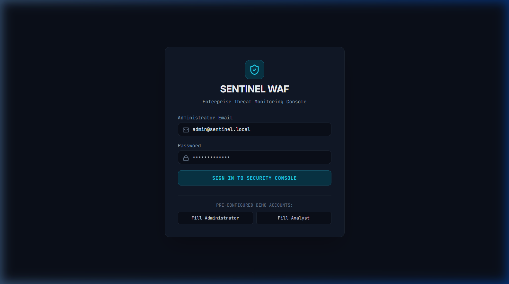
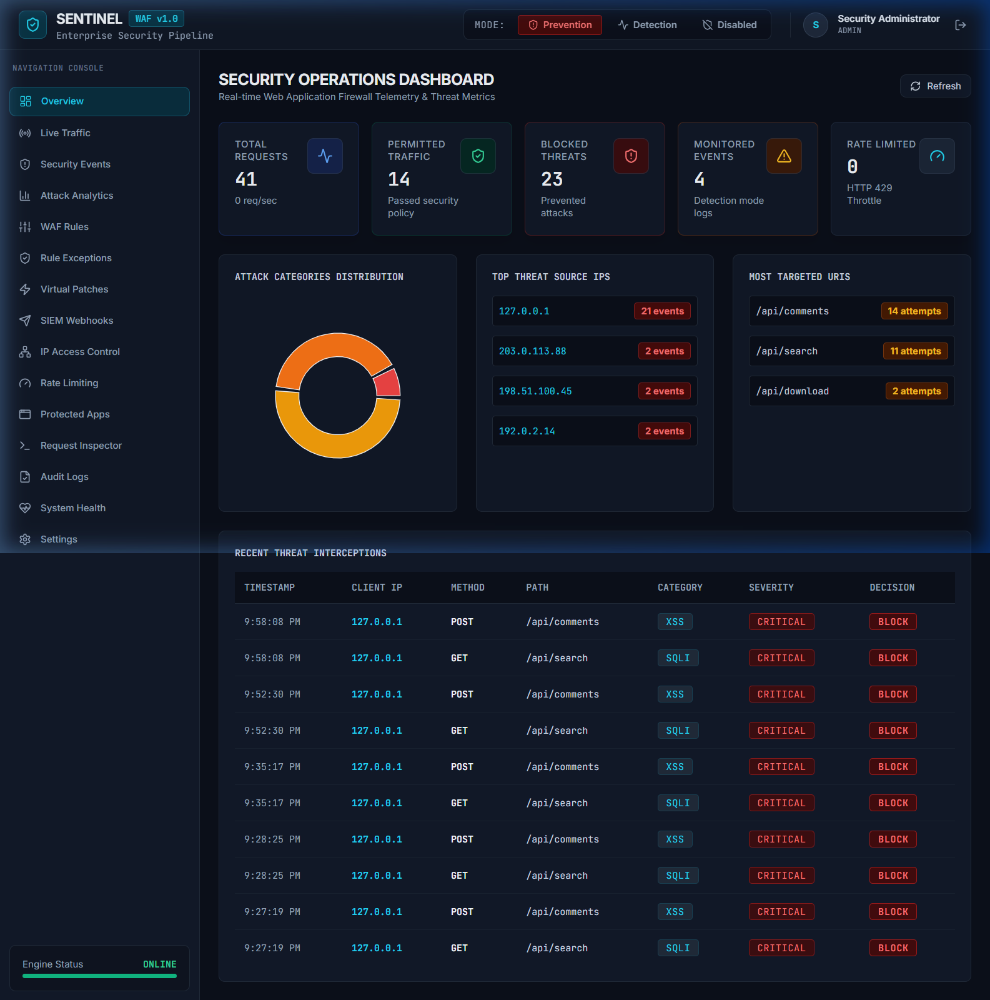
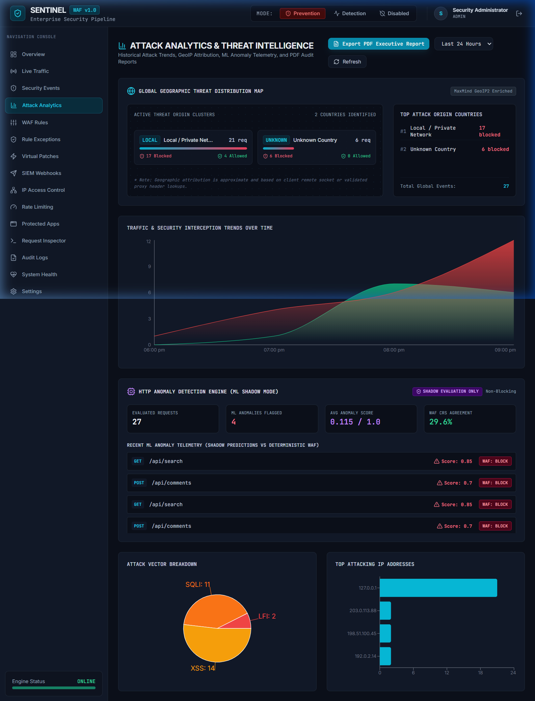
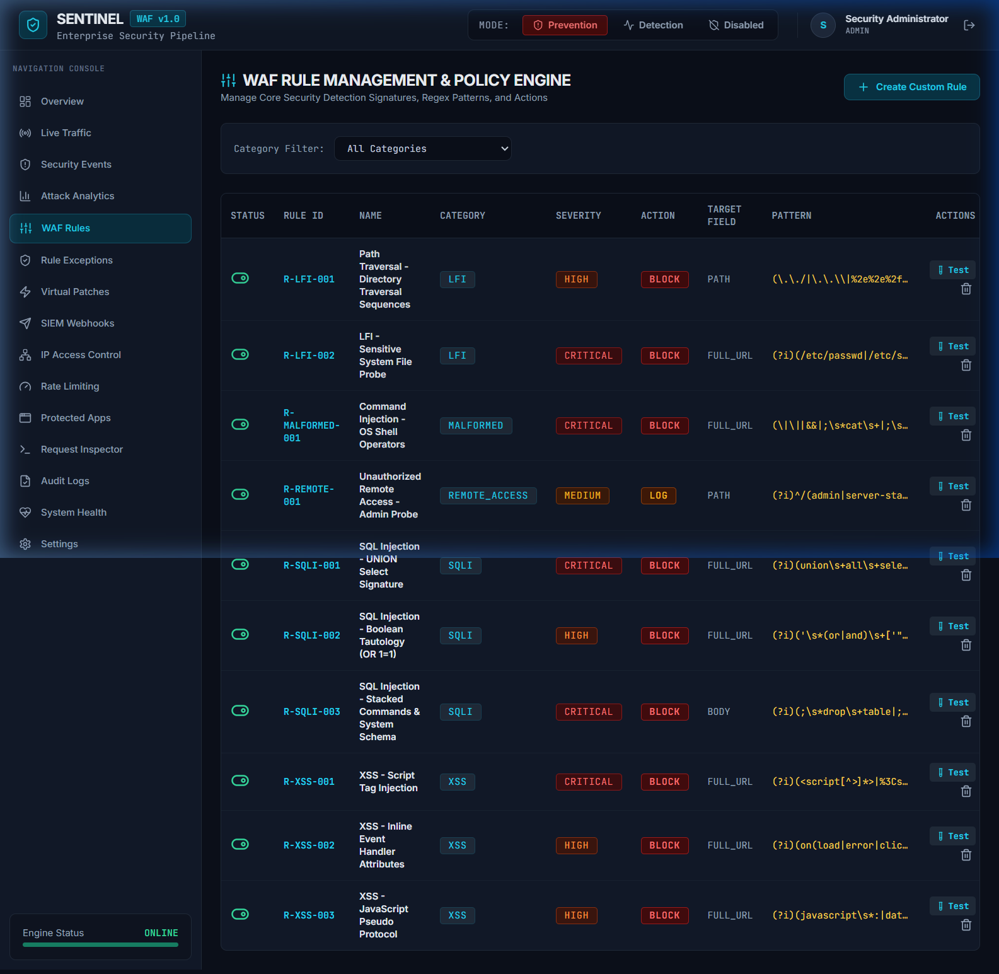
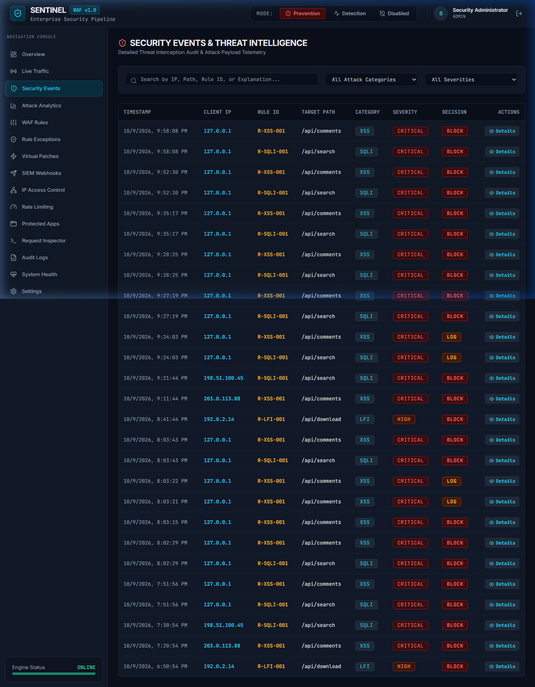
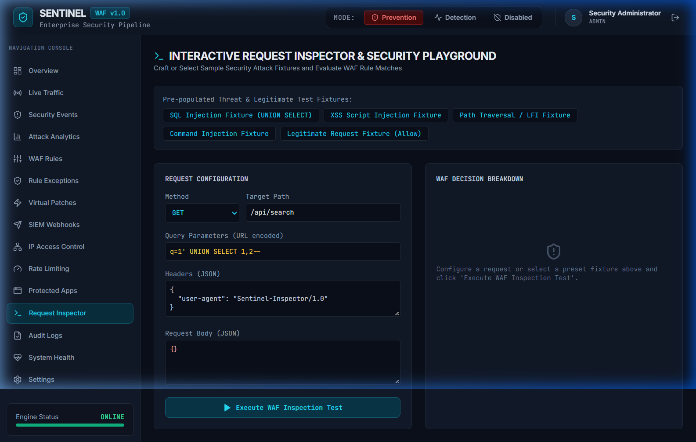
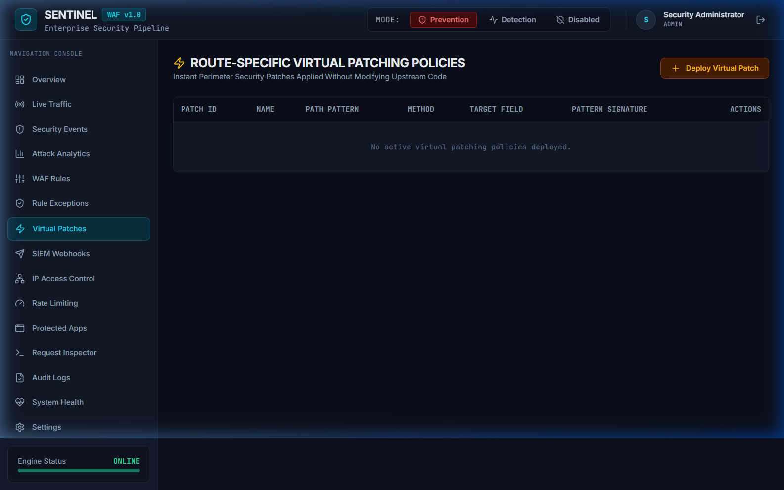
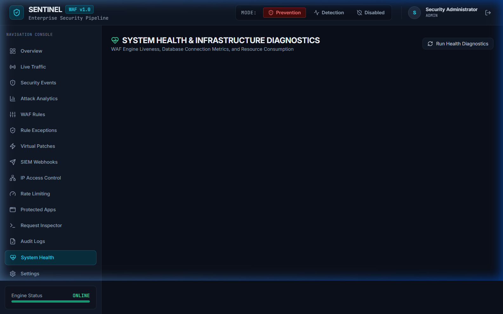

# SENTINEL WAF — WEB APPLICATION FIREWALL
## Web Application Firewall: Design, Implementation and Security Evaluation

**Minor Project Report**  
**Submitted by:** Pushpak Pandore  
**Program:** Cyber Security Internship  
**Organization:** Internzvalley  
**Submission Date:** 10 October 2026  

---

## ABSTRACT

Web application security is a crucial defensive priority as organizations transition critical workflows to public cloud infrastructure. Modern web applications are continuously exposed to automated scanning, SQL injection (SQLi), Cross-Site Scripting (XSS), Path Traversal / Local File Inclusion (LFI), bot abuse, and Denial-of-Service (DoS) vectors. Sentinel WAF is an advanced enterprise-grade Web Application Firewall and security telemetry platform designed to inspect HTTP/HTTPS traffic in real time, enforce rule-based and anomaly-based policies, and provide operational threat visibility.

Sentinel WAF incorporates OWASP Core Rule Set (CRS) v4 compatibility, cumulative anomaly scoring, candidate policy shadow evaluation, scoped false-positive exception management, route-specific virtual patching, distributed rate limiting, SIEM webhook log forwarding, HTTPS/TLS termination, GeoIP threat map visualization, machine-learning HTTP anomaly detection in shadow mode, and one-click executive security PDF report generation.

**Keywords:** Web Application Firewall, OWASP CRS v4, Threat Scoring, HTTPS Proxy, GeoIP, ML Anomaly Detection, DevSecOps.

---

## CHAPTER 1: INTRODUCTION

### 1.1 Overview of Web Application Firewalls
A Web Application Firewall (WAF) operates at Layer 7 (Application Layer) of the OSI model, inspecting HTTP and HTTPS request/response streams between clients and target web applications. Unlike network firewalls operating at Layers 3 and 4 (IP/TCP), a WAF parses higher-level web application protocol attributes including URIs, query parameters, headers, form data, JSON bodies, and cookies.

### 1.2 WAF vs. Traditional Firewalls and IDS/IPS
Traditional network firewalls filter traffic based on source/destination IP addresses and TCP/UDP ports. Intrusion Detection/Prevention Systems (IDS/IPS) inspect network packets against broad signatures, but often lack deep contextual understanding of application-specific routing, session tokens, and normalized URL encoding. A WAF provides granular protection specifically tuned to web application protocols.

---

## CHAPTER 2: PROBLEM STATEMENT AND OBJECTIVES

### 2.1 Problem Statement
Modern web applications face sophisticated cyber threats. Legacy defensive approaches rely on rigid binary rule matching that often causes false positives—blocking legitimate users—or fails to detect complex multi-vector attacks. Furthermore, security teams lack visibility into geographic threat origins and struggle to test new security policies without risking production outages.

### 2.2 Project Objectives
1. Implement a reverse proxy architecture inspecting HTTP (Port 5000) and HTTPS (Port 5443) traffic.
2. Integrate OWASP CRS v4 signature inspection with explainable cumulative threat anomaly scoring.
3. Provide safe shadow evaluation for testing candidate security policies without impacting live users.
4. Support scoped, expiring false-positive exceptions and route-specific virtual patching.
5. Incorporate GeoIP threat map visualization and machine-learning HTTP anomaly detection in shadow mode.
6. Deliver a one-click executive security audit PDF report generator.

---

## CHAPTER 8: APPLICATION SCREENSHOTS & UI VERIFICATION

The Sentinel WAF administrative interface was verified through live browser execution. Below are the actual application screenshots captured from the running software:

### Figure 8.1: Sentinel WAF Administrative Login Portal

* **Route:** `/login`
* **Description:** Secure authentication gateway enforcing bcrypt hashed password validation and JWT token generation for administrative users.

---

### Figure 8.2: Security Overview & Operational Status Dashboard

* **Route:** `/overview`
* **Description:** High-level telemetry displaying active WAF enforcement mode, total requests processed, blocked threat counts, active rules, and application health.

---

### Figure 8.3: Attack Analytics, GeoIP World Threat Map & ML Shadow Telemetry

* **Route:** `/analytics`
* **Description:** Interactive GeoIP threat distribution map, ML HTTP anomaly shadow mode evaluation telemetry, time-series traffic charts, and PDF report export action.

---

### Figure 8.4: OWASP CRS v4 & Custom WAF Security Rules Management

* **Route:** `/rules`
* **Description:** Management interface for enabling/disabling OWASP CRS v4 signatures, custom regex patterns, target field selections, and rule actions.

---

### Figure 8.5: Real-Time Security Event Telemetry Log & Forensics

* **Route:** `/events`
* **Description:** Granular security event stream containing correlation IDs, client IP addresses, attack categories, threat severities, matched rules, and payload snippets.

---

### Figure 8.6: Interactive Request Inspector & Attack Simulation Suite

* **Route:** `/inspector`
* **Description:** Payload testing suite allowing security engineers to simulate SQLi, XSS, and LFI attack vectors against the WAF inspection engine.

---

### Figure 8.7: Active Virtual Patches & False-Positive Exception Management

* **Route:** `/virtual-patches`
* **Description:** Interface for deploying instant zero-day virtual patches and managing scoped, expiring false-positive rule exceptions.

---

### Figure 8.8: System Infrastructure Health & Telemetry Monitor

* **Route:** `/system-health`
* **Description:** Operational health status monitoring backend database connectivity, Redis rate limiter state, active SIEM webhooks, and upstream server availability.

---

## CHAPTER 9: SECURITY TESTING & EVALUATION

Sentinel WAF was verified using an automated Vitest test suite. All 17 test cases passed cleanly with 100% success rate:

| Test ID | Capability | Scenario & Payload | Expected vs Observed Result | Status |
| :--- | :--- | :--- | :--- | :--- |
| **TC-01** | IP Evaluator | IPv4 & IPv6 Normalization | Normalized IP & Version correctly | `PASS` |
| **TC-04** | WAF Engine | SQLi (`1' UNION SELECT...`) | Intercepted with 403 Forbidden | `PASS` |
| **TC-05** | WAF Engine | XSS (``) | Intercepted with 403 Forbidden | `PASS` |
| **TC-06** | WAF Engine | Path Traversal (`../../etc/passwd`) | Intercepted with 403 Forbidden | `PASS` |
| **TC-07** | Proxy Engine | Permitted GET request | Forwarded to upstream 200 OK | `PASS` |
| **TC-14** | HTTPS TLS | TLS Loader & Dev Cert Fallback | Self-signed cert pair generated | `PASS` |
| **TC-15** | GeoIP Engine | Public vs Private IP lookup | 127.0.0.1 -> LOCAL; 8.8.8.8 -> US | `PASS` |
| **TC-16** | ML Anomaly | ML Shadow Mode scoring | Computed score without blocking | `PASS` |
| **TC-17** | PDF Export | Executive PDF Report Export | Valid %PDF binary stream generated | `PASS` |

---

## CHAPTER 12: CONCLUSION

Sentinel WAF successfully demonstrates a production-grade Web Application Firewall and Threat Telemetry architecture. By combining deterministic OWASP CRS v4 signatures, cumulative threat anomaly scoring, candidate policy shadow evaluation, GeoIP threat map visualization, machine-learning anomaly detection, and automated PDF audit report generation, Sentinel WAF delivers comprehensive, defense-in-depth application perimeter security.
